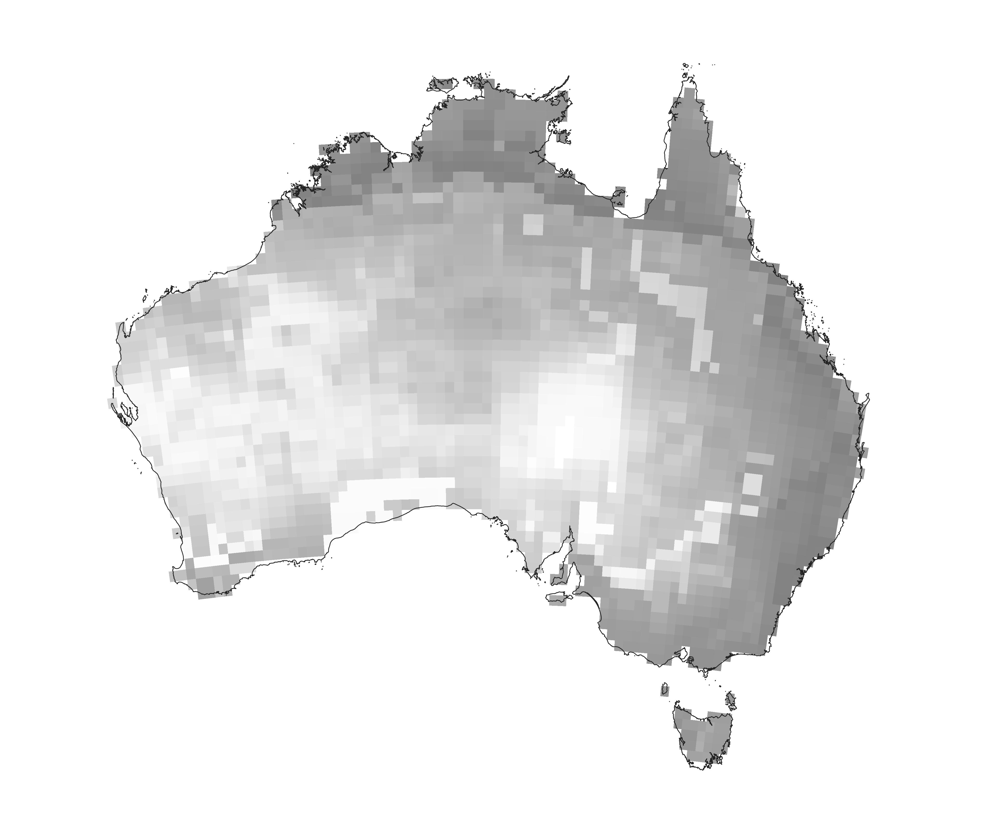

# Estimating pre-European population size for Australia

R translation of the Australia-wide 'hunter-gatherer' (non-agropastoralist) population estimate pipeline from Zhu et al. 2021 (<a href="https://doi.org/10.1038/s41559-021-01548-3">Global hunter-gatherer population densities constrained by influence of seasonality on diet composition</a>. <em>Nature Ecology and Evolution</em> 5:1536-1545) supplementary <a href="https://static-content.springer.com/esm/art%3A10.1038%2Fs41559-021-01548-3/MediaObjects/41559_2021_1548_MOESM5_ESM.zip">source code</a> in Python.

## Focal manuscript
<a href="https://au.linkedin.com/in/alan-williams-7973a958">Williams, AN</a>, <a href="https://evolutionofculturaldiversity.anu.edu.au/our-people/ray-tobler/">R Tobler</a>, <a href="https://experts.deakin.edu.au/42085-billy-griffiths">B Griffiths</a>, <a href="https://portfolio.jcu.edu.au/researchers/sean.ulm/">S Ulm</a>, <a href="https://www.flinders.edu.au/people/cody.nitschke">MC Nitschke</a>, <a href="https://portfolio.jcu.edu.au/researchers/michael.bird">MI Bird</a>, <a href="https://scholars.uow.edu.au/shane-ingrey">S Ingrey</a>, <a href="https://www.flinders.edu.au/people/frederik.saltre">F Saltré</a>, <a href="https://www.facebook.com/profile.php?id=100076324899510">K Beller</a>, <a href="https://research.monash.edu/en/persons/ian-mcniven">IJ McNiven</a>, <a href="https://au.linkedin.com/in/nick-pitt-772440ba">N Pitt</a>, <a href="https://research.monash.edu/en/persons/lynette-russell-am">L Russell</a>, <a href="https://discover.utas.edu.au/Christopher.Wilson">C Wilson</a>, <a href="https://www.flinders.edu.au/people/corey.bradshaw">CJA Bradshaw</a>. <a href="">Large size of the Australian Indigenous population prior to its massive decline following European invasion</a>. <em>Nature Human Behaviour</em> In review

## Contents
- `scripts/estimate_australia.R`: R implementation of the Australia-wide estimate
- `INPUT/AUS.geojson`: Australia polygon used for area-weighted intersections
- `OUTPUT/globe_S0.nc`, `OUTPUT/globe_S1.nc`, `OUTPUT/globe_S2.nc`: bundled FORGE global outputs copied from Zhu et al. (2021)
- `OUTPUT/Australia_population_estimate.txt`: generated summary report

## Required R packages
<code>lwgeom</code>, <code>ncdf4</code>, <code>sf</code>

### Optional arguments:
- Rscript Source/estimate_australia.R --scenario S2 (most likely scenario from Zhu et al. 2021)
- Rscript Source/estimate_australia.R --ci-level 0.95 --density-cv 0.7 (an assumed proportional standard deviation on density; not measured)
- Rscript Source/estimate_australia.R --output-dir OUTPUT --country-geojson INPUT/AUS.geojson (Australia polygon)

## Current default assumptions
- preferred run is `S2`.
- 95% confidence interval based on assumed **density uncertainty**, not scenario spread
- default density uncertainty assumption is **SD = 0.7 × mean density**, following **Bradshaw et al. (2021)** (doi:<a href="http://doi.org/10.1038/s41467-021-21551-3">10.1038/s41467-021-21551-3</a>)
- confidence interval computed with **log-Normal** distribution to ensure population total interval remains positive
 

    &nbsp;  &nbsp;  &nbsp;  &nbsp;  &nbsp;  &nbsp;   
